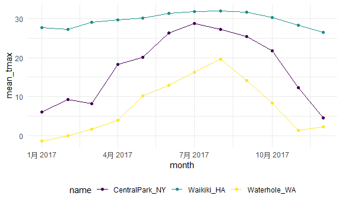
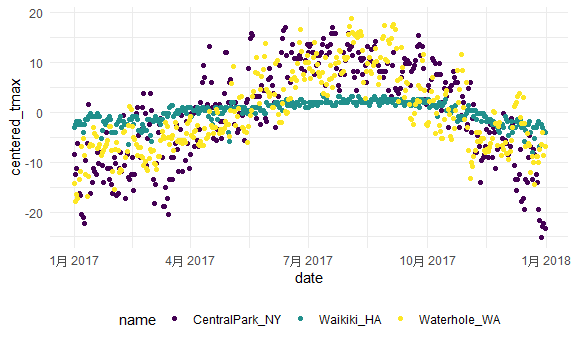

Exploratory data
================
Yuchen Hua
2022-09-30

## Load the weather data

``` r
weather_df =  
  rnoaa::meteo_pull_monitors(
    c("USW00094728", "USC00519397", "USS0023B17S"),
    var = c("PRCP", "TMIN", "TMAX"), 
    date_min = "2017-01-01",
    date_max = "2017-12-31") %>%
  mutate(
    name = recode(
      id, 
      USW00094728 = "CentralPark_NY", 
      USC00519397 = "Waikiki_HA",
      USS0023B17S = "Waterhole_WA"),
    tmin = tmin / 10,
    tmax = tmax / 10,
    month = lubridate::floor_date(date, unit = "month")) %>%
  select(name, id, everything())
```

    ## Registered S3 method overwritten by 'hoardr':
    ##   method           from
    ##   print.cache_info httr

    ## using cached file: C:\Users\Yuchen\AppData\Local/Cache/R/noaa_ghcnd/USW00094728.dly

    ## date created (size, mb): 2022-09-23 23:17:51 (8.419)

    ## file min/max dates: 1869-01-01 / 2022-09-30

    ## using cached file: C:\Users\Yuchen\AppData\Local/Cache/R/noaa_ghcnd/USC00519397.dly

    ## date created (size, mb): 2022-09-23 23:17:58 (1.703)

    ## file min/max dates: 1965-01-01 / 2020-03-31

    ## using cached file: C:\Users\Yuchen\AppData\Local/Cache/R/noaa_ghcnd/USS0023B17S.dly

    ## date created (size, mb): 2022-09-23 23:18:01 (0.952)

    ## file min/max dates: 1999-09-01 / 2022-09-30

``` r
weather_df
```

    ## # A tibble: 1,095 × 7
    ##    name           id          date        prcp  tmax  tmin month     
    ##    <chr>          <chr>       <date>     <dbl> <dbl> <dbl> <date>    
    ##  1 CentralPark_NY USW00094728 2017-01-01     0   8.9   4.4 2017-01-01
    ##  2 CentralPark_NY USW00094728 2017-01-02    53   5     2.8 2017-01-01
    ##  3 CentralPark_NY USW00094728 2017-01-03   147   6.1   3.9 2017-01-01
    ##  4 CentralPark_NY USW00094728 2017-01-04     0  11.1   1.1 2017-01-01
    ##  5 CentralPark_NY USW00094728 2017-01-05     0   1.1  -2.7 2017-01-01
    ##  6 CentralPark_NY USW00094728 2017-01-06    13   0.6  -3.8 2017-01-01
    ##  7 CentralPark_NY USW00094728 2017-01-07    81  -3.2  -6.6 2017-01-01
    ##  8 CentralPark_NY USW00094728 2017-01-08     0  -3.8  -8.8 2017-01-01
    ##  9 CentralPark_NY USW00094728 2017-01-09     0  -4.9  -9.9 2017-01-01
    ## 10 CentralPark_NY USW00094728 2017-01-10     0   7.8  -6   2017-01-01
    ## # … with 1,085 more rows

## ‘group_by’

``` r
weather_df %>%
  group_by(name)
```

    ## # A tibble: 1,095 × 7
    ## # Groups:   name [3]
    ##    name           id          date        prcp  tmax  tmin month     
    ##    <chr>          <chr>       <date>     <dbl> <dbl> <dbl> <date>    
    ##  1 CentralPark_NY USW00094728 2017-01-01     0   8.9   4.4 2017-01-01
    ##  2 CentralPark_NY USW00094728 2017-01-02    53   5     2.8 2017-01-01
    ##  3 CentralPark_NY USW00094728 2017-01-03   147   6.1   3.9 2017-01-01
    ##  4 CentralPark_NY USW00094728 2017-01-04     0  11.1   1.1 2017-01-01
    ##  5 CentralPark_NY USW00094728 2017-01-05     0   1.1  -2.7 2017-01-01
    ##  6 CentralPark_NY USW00094728 2017-01-06    13   0.6  -3.8 2017-01-01
    ##  7 CentralPark_NY USW00094728 2017-01-07    81  -3.2  -6.6 2017-01-01
    ##  8 CentralPark_NY USW00094728 2017-01-08     0  -3.8  -8.8 2017-01-01
    ##  9 CentralPark_NY USW00094728 2017-01-09     0  -4.9  -9.9 2017-01-01
    ## 10 CentralPark_NY USW00094728 2017-01-10     0   7.8  -6   2017-01-01
    ## # … with 1,085 more rows

``` r
weather_df %>%
  group_by(name, month)
```

    ## # A tibble: 1,095 × 7
    ## # Groups:   name, month [36]
    ##    name           id          date        prcp  tmax  tmin month     
    ##    <chr>          <chr>       <date>     <dbl> <dbl> <dbl> <date>    
    ##  1 CentralPark_NY USW00094728 2017-01-01     0   8.9   4.4 2017-01-01
    ##  2 CentralPark_NY USW00094728 2017-01-02    53   5     2.8 2017-01-01
    ##  3 CentralPark_NY USW00094728 2017-01-03   147   6.1   3.9 2017-01-01
    ##  4 CentralPark_NY USW00094728 2017-01-04     0  11.1   1.1 2017-01-01
    ##  5 CentralPark_NY USW00094728 2017-01-05     0   1.1  -2.7 2017-01-01
    ##  6 CentralPark_NY USW00094728 2017-01-06    13   0.6  -3.8 2017-01-01
    ##  7 CentralPark_NY USW00094728 2017-01-07    81  -3.2  -6.6 2017-01-01
    ##  8 CentralPark_NY USW00094728 2017-01-08     0  -3.8  -8.8 2017-01-01
    ##  9 CentralPark_NY USW00094728 2017-01-09     0  -4.9  -9.9 2017-01-01
    ## 10 CentralPark_NY USW00094728 2017-01-10     0   7.8  -6   2017-01-01
    ## # … with 1,085 more rows

## Counting things

count month observations

``` r
weather_df %>%
  group_by(month) %>%
  summarize(n_obs = n())
```

    ## # A tibble: 12 × 2
    ##    month      n_obs
    ##    <date>     <int>
    ##  1 2017-01-01    93
    ##  2 2017-02-01    84
    ##  3 2017-03-01    93
    ##  4 2017-04-01    90
    ##  5 2017-05-01    93
    ##  6 2017-06-01    90
    ##  7 2017-07-01    93
    ##  8 2017-08-01    93
    ##  9 2017-09-01    90
    ## 10 2017-10-01    93
    ## 11 2017-11-01    90
    ## 12 2017-12-01    93

``` r
weather_df %>%
  group_by(name) %>%
  summarize(n_obs = n())
```

    ## # A tibble: 3 × 2
    ##   name           n_obs
    ##   <chr>          <int>
    ## 1 CentralPark_NY   365
    ## 2 Waikiki_HA       365
    ## 3 Waterhole_WA     365

``` r
weather_df %>%
  group_by(name, month) %>%
  summarize(n_obs = n())
```

    ## `summarise()` has grouped output by 'name'. You can override using the
    ## `.groups` argument.

    ## # A tibble: 36 × 3
    ## # Groups:   name [3]
    ##    name           month      n_obs
    ##    <chr>          <date>     <int>
    ##  1 CentralPark_NY 2017-01-01    31
    ##  2 CentralPark_NY 2017-02-01    28
    ##  3 CentralPark_NY 2017-03-01    31
    ##  4 CentralPark_NY 2017-04-01    30
    ##  5 CentralPark_NY 2017-05-01    31
    ##  6 CentralPark_NY 2017-06-01    30
    ##  7 CentralPark_NY 2017-07-01    31
    ##  8 CentralPark_NY 2017-08-01    31
    ##  9 CentralPark_NY 2017-09-01    30
    ## 10 CentralPark_NY 2017-10-01    31
    ## # … with 26 more rows

we can use ‘count()’

``` r
weather_df %>%
  count(name, month, name = "n_obs")
```

    ## # A tibble: 36 × 3
    ##    name           month      n_obs
    ##    <chr>          <date>     <int>
    ##  1 CentralPark_NY 2017-01-01    31
    ##  2 CentralPark_NY 2017-02-01    28
    ##  3 CentralPark_NY 2017-03-01    31
    ##  4 CentralPark_NY 2017-04-01    30
    ##  5 CentralPark_NY 2017-05-01    31
    ##  6 CentralPark_NY 2017-06-01    30
    ##  7 CentralPark_NY 2017-07-01    31
    ##  8 CentralPark_NY 2017-08-01    31
    ##  9 CentralPark_NY 2017-09-01    30
    ## 10 CentralPark_NY 2017-10-01    31
    ## # … with 26 more rows

**Never** used base R’s ‘table’

``` r
weather_df %>%
  pull(month) %>%
  table()
```

other helpful counters

``` r
weather_df %>%
  group_by(month) %>%
  summarize(
    n_ons = n(),
    n_days = n_distinct(date)
  )
```

    ## # A tibble: 12 × 3
    ##    month      n_ons n_days
    ##    <date>     <int>  <int>
    ##  1 2017-01-01    93     31
    ##  2 2017-02-01    84     28
    ##  3 2017-03-01    93     31
    ##  4 2017-04-01    90     30
    ##  5 2017-05-01    93     31
    ##  6 2017-06-01    90     30
    ##  7 2017-07-01    93     31
    ##  8 2017-08-01    93     31
    ##  9 2017-09-01    90     30
    ## 10 2017-10-01    93     31
    ## 11 2017-11-01    90     30
    ## 12 2017-12-01    93     31

## A digression on 2x2 table

``` r
weather_df %>%
  filter(name != "Wakiki_HA") %>%
  mutate(
    cold = case_when(
      tmax < 5 ~ "cold",
      tmax >= 5 ~ "not_cold",
      TRUE   ~ ""
    )
  ) 
```

    ## # A tibble: 1,095 × 8
    ##    name           id          date        prcp  tmax  tmin month      cold    
    ##    <chr>          <chr>       <date>     <dbl> <dbl> <dbl> <date>     <chr>   
    ##  1 CentralPark_NY USW00094728 2017-01-01     0   8.9   4.4 2017-01-01 not_cold
    ##  2 CentralPark_NY USW00094728 2017-01-02    53   5     2.8 2017-01-01 not_cold
    ##  3 CentralPark_NY USW00094728 2017-01-03   147   6.1   3.9 2017-01-01 not_cold
    ##  4 CentralPark_NY USW00094728 2017-01-04     0  11.1   1.1 2017-01-01 not_cold
    ##  5 CentralPark_NY USW00094728 2017-01-05     0   1.1  -2.7 2017-01-01 cold    
    ##  6 CentralPark_NY USW00094728 2017-01-06    13   0.6  -3.8 2017-01-01 cold    
    ##  7 CentralPark_NY USW00094728 2017-01-07    81  -3.2  -6.6 2017-01-01 cold    
    ##  8 CentralPark_NY USW00094728 2017-01-08     0  -3.8  -8.8 2017-01-01 cold    
    ##  9 CentralPark_NY USW00094728 2017-01-09     0  -4.9  -9.9 2017-01-01 cold    
    ## 10 CentralPark_NY USW00094728 2017-01-10     0   7.8  -6   2017-01-01 not_cold
    ## # … with 1,085 more rows

``` r
weather_df %>%
  filter(name != "Wakiki_HA") %>%
  mutate(
    cold = case_when(
      tmax < 5 ~ "cold",
      tmax >= 5 ~ "not_cold",
      TRUE   ~ ""
    )
  ) %>%
  group_by(name, cold) %>%
  summarize(count = n())
```

    ## `summarise()` has grouped output by 'name'. You can override using the
    ## `.groups` argument.

    ## # A tibble: 6 × 3
    ## # Groups:   name [3]
    ##   name           cold       count
    ##   <chr>          <chr>      <int>
    ## 1 CentralPark_NY "cold"        44
    ## 2 CentralPark_NY "not_cold"   321
    ## 3 Waikiki_HA     ""             3
    ## 4 Waikiki_HA     "not_cold"   362
    ## 5 Waterhole_WA   "cold"       172
    ## 6 Waterhole_WA   "not_cold"   193

``` r
weather_df %>%
  filter(name != "Wakiki_HA") %>%
  mutate(
    cold = case_when(
      tmax <  5 ~ "cold",
      tmax >= 5 ~ "not_cold",
      TRUE      ~ ""
    )
  ) %>%
  janitor::tabyl(name, cold)
```

    ##            name cold not_cold emptystring_
    ##  CentralPark_NY   44      321            0
    ##      Waikiki_HA    0      362            3
    ##    Waterhole_WA  172      193            0

## General summaries

You can do lots of summaries.

``` r
weather_df %>%
  group_by(month) %>%
  summarize(
    mean_tmax = mean(tmax)
  )
```

    ## # A tibble: 12 × 2
    ##    month      mean_tmax
    ##    <date>         <dbl>
    ##  1 2017-01-01      10.8
    ##  2 2017-02-01      12.2
    ##  3 2017-03-01      13.0
    ##  4 2017-04-01      17.3
    ##  5 2017-05-01      NA  
    ##  6 2017-06-01      23.5
    ##  7 2017-07-01      NA  
    ##  8 2017-08-01      26.3
    ##  9 2017-09-01      23.8
    ## 10 2017-10-01      20.1
    ## 11 2017-11-01      14.0
    ## 12 2017-12-01      11.0

``` r
weather_df %>%
  group_by(name, month) %>%
  summarize(
    mean_tmax = mean(tmax, na.rm = TRUE),
    mean_prcp = mean(prcp, na.rm = TRUE),
    median_tmin = median(tmin, na.rm = TRUE)
  )
```

    ## `summarise()` has grouped output by 'name'. You can override using the
    ## `.groups` argument.

    ## # A tibble: 36 × 5
    ## # Groups:   name [3]
    ##    name           month      mean_tmax mean_prcp median_tmin
    ##    <chr>          <date>         <dbl>     <dbl>       <dbl>
    ##  1 CentralPark_NY 2017-01-01      5.98      39.5         1.7
    ##  2 CentralPark_NY 2017-02-01      9.28      22.5         1.4
    ##  3 CentralPark_NY 2017-03-01      8.22      43.0         1.1
    ##  4 CentralPark_NY 2017-04-01     18.3       32.5         8.9
    ##  5 CentralPark_NY 2017-05-01     20.1       52.3        11.7
    ##  6 CentralPark_NY 2017-06-01     26.3       40.4        18.9
    ##  7 CentralPark_NY 2017-07-01     28.7       34.3        21.1
    ##  8 CentralPark_NY 2017-08-01     27.2       27.4        20  
    ##  9 CentralPark_NY 2017-09-01     25.4       17.0        18.4
    ## 10 CentralPark_NY 2017-10-01     21.8       34.3        13.9
    ## # … with 26 more rows

This is a dataframe so we can make a plot.

``` r
weather_df %>%
  group_by(name, month) %>%
  summarize(
    mean_tmax = mean(tmax, na.rm = TRUE),
    mean_prcp = mean(prcp, na.rm = TRUE),
    median_tmin = median(tmin, na.rm = TRUE)
  ) %>%
  ggplot(aes(x = month, y = mean_tmax, color = name)) + 
  geom_point() +
  geom_line()
```

    ## `summarise()` has grouped output by 'name'. You can override using the
    ## `.groups` argument.



Suppose you want to summarize many colums.

``` r
weather_df %>%
  group_by(name, month) %>%
  summarize(across(prcp:tmin, mean))
```

    ## `summarise()` has grouped output by 'name'. You can override using the
    ## `.groups` argument.

    ## # A tibble: 36 × 5
    ## # Groups:   name [3]
    ##    name           month       prcp  tmax   tmin
    ##    <chr>          <date>     <dbl> <dbl>  <dbl>
    ##  1 CentralPark_NY 2017-01-01  39.5  5.98  0.748
    ##  2 CentralPark_NY 2017-02-01  22.5  9.28  1.45 
    ##  3 CentralPark_NY 2017-03-01  43.0  8.22 -0.177
    ##  4 CentralPark_NY 2017-04-01  32.5 18.3   9.66 
    ##  5 CentralPark_NY 2017-05-01  52.3 20.1  12.2  
    ##  6 CentralPark_NY 2017-06-01  40.4 26.3  18.2  
    ##  7 CentralPark_NY 2017-07-01  34.3 28.7  21.0  
    ##  8 CentralPark_NY 2017-08-01  27.4 27.2  19.5  
    ##  9 CentralPark_NY 2017-09-01  17.0 25.4  17.4  
    ## 10 CentralPark_NY 2017-10-01  34.3 21.8  13.9  
    ## # … with 26 more rows

Reminder: sometimes your results are easier to read in another format.

``` r
weather_df %>%
  group_by(name, month) %>%
  summarize(mean_tmax = mean(tmax)) %>%
  pivot_wider(
    names_from = name,
    values_from = mean_tmax
  ) %>%
  knitr::kable(digits = 1)
```

    ## `summarise()` has grouped output by 'name'. You can override using the
    ## `.groups` argument.

| month      | CentralPark_NY | Waikiki_HA | Waterhole_WA |
|:-----------|---------------:|-----------:|-------------:|
| 2017-01-01 |            6.0 |       27.8 |         -1.4 |
| 2017-02-01 |            9.3 |       27.2 |          0.0 |
| 2017-03-01 |            8.2 |       29.1 |          1.7 |
| 2017-04-01 |           18.3 |       29.7 |          3.9 |
| 2017-05-01 |           20.1 |         NA |         10.1 |
| 2017-06-01 |           26.3 |       31.3 |         12.9 |
| 2017-07-01 |           28.7 |         NA |         16.3 |
| 2017-08-01 |           27.2 |       32.0 |         19.6 |
| 2017-09-01 |           25.4 |       31.7 |         14.2 |
| 2017-10-01 |           21.8 |       30.3 |          8.3 |
| 2017-11-01 |           12.3 |       28.4 |          1.4 |
| 2017-12-01 |            4.5 |       26.5 |          2.2 |

## ‘group_by’ and ‘mutate’

``` r
weather_df %>%
  group_by(name) %>%
  mutate(
    mean_tmax = mean(tmax, na.rm = TRUE),
    centered_tmax = tmax - mean_tmax
  )
```

    ## # A tibble: 1,095 × 9
    ## # Groups:   name [3]
    ##    name           id     date        prcp  tmax  tmin month      mean_…¹ cente…²
    ##    <chr>          <chr>  <date>     <dbl> <dbl> <dbl> <date>       <dbl>   <dbl>
    ##  1 CentralPark_NY USW00… 2017-01-01     0   8.9   4.4 2017-01-01    17.4   -8.47
    ##  2 CentralPark_NY USW00… 2017-01-02    53   5     2.8 2017-01-01    17.4  -12.4 
    ##  3 CentralPark_NY USW00… 2017-01-03   147   6.1   3.9 2017-01-01    17.4  -11.3 
    ##  4 CentralPark_NY USW00… 2017-01-04     0  11.1   1.1 2017-01-01    17.4   -6.27
    ##  5 CentralPark_NY USW00… 2017-01-05     0   1.1  -2.7 2017-01-01    17.4  -16.3 
    ##  6 CentralPark_NY USW00… 2017-01-06    13   0.6  -3.8 2017-01-01    17.4  -16.8 
    ##  7 CentralPark_NY USW00… 2017-01-07    81  -3.2  -6.6 2017-01-01    17.4  -20.6 
    ##  8 CentralPark_NY USW00… 2017-01-08     0  -3.8  -8.8 2017-01-01    17.4  -21.2 
    ##  9 CentralPark_NY USW00… 2017-01-09     0  -4.9  -9.9 2017-01-01    17.4  -22.3 
    ## 10 CentralPark_NY USW00… 2017-01-10     0   7.8  -6   2017-01-01    17.4   -9.57
    ## # … with 1,085 more rows, and abbreviated variable names ¹​mean_tmax,
    ## #   ²​centered_tmax

``` r
weather_df %>%
  group_by(name) %>%
  mutate(
    mean_tmax = mean(tmax, na.rm = TRUE),
    centered_tmax = tmax - mean_tmax
  ) %>%
  ggplot(aes(x = date, y = centered_tmax, color = name)) + 
  geom_point()
```

    ## Warning: Removed 3 rows containing missing values (geom_point).



what about window functions

ranking ..

``` r
weather_df %>%
  group_by(name, month) %>%
  mutate(temp_rank = min_rank(tmax)) %>%
  filter(temp_rank == 1)
```

    ## # A tibble: 42 × 8
    ## # Groups:   name, month [36]
    ##    name           id          date        prcp  tmax  tmin month      temp_rank
    ##    <chr>          <chr>       <date>     <dbl> <dbl> <dbl> <date>         <int>
    ##  1 CentralPark_NY USW00094728 2017-01-09     0  -4.9  -9.9 2017-01-01         1
    ##  2 CentralPark_NY USW00094728 2017-02-10     0   0    -7.1 2017-02-01         1
    ##  3 CentralPark_NY USW00094728 2017-03-15     0  -3.2  -6.6 2017-03-01         1
    ##  4 CentralPark_NY USW00094728 2017-04-01     0   8.9   2.8 2017-04-01         1
    ##  5 CentralPark_NY USW00094728 2017-05-13   409  11.7   7.2 2017-05-01         1
    ##  6 CentralPark_NY USW00094728 2017-06-06    15  14.4  11.1 2017-06-01         1
    ##  7 CentralPark_NY USW00094728 2017-07-25     0  21.7  16.7 2017-07-01         1
    ##  8 CentralPark_NY USW00094728 2017-08-29    74  20    16.1 2017-08-01         1
    ##  9 CentralPark_NY USW00094728 2017-09-30     0  18.9  12.2 2017-09-01         1
    ## 10 CentralPark_NY USW00094728 2017-10-31     0  13.9   7.2 2017-10-01         1
    ## # … with 32 more rows

``` r
weather_df %>%
  group_by(name, month) %>%
  mutate(temp_rank = min_rank(tmax)) %>%
  filter(temp_rank == min_rank(tmax))
```

    ## # A tibble: 1,092 × 8
    ## # Groups:   name, month [36]
    ##    name           id          date        prcp  tmax  tmin month      temp_rank
    ##    <chr>          <chr>       <date>     <dbl> <dbl> <dbl> <date>         <int>
    ##  1 CentralPark_NY USW00094728 2017-01-01     0   8.9   4.4 2017-01-01        22
    ##  2 CentralPark_NY USW00094728 2017-01-02    53   5     2.8 2017-01-01        12
    ##  3 CentralPark_NY USW00094728 2017-01-03   147   6.1   3.9 2017-01-01        15
    ##  4 CentralPark_NY USW00094728 2017-01-04     0  11.1   1.1 2017-01-01        27
    ##  5 CentralPark_NY USW00094728 2017-01-05     0   1.1  -2.7 2017-01-01         5
    ##  6 CentralPark_NY USW00094728 2017-01-06    13   0.6  -3.8 2017-01-01         4
    ##  7 CentralPark_NY USW00094728 2017-01-07    81  -3.2  -6.6 2017-01-01         3
    ##  8 CentralPark_NY USW00094728 2017-01-08     0  -3.8  -8.8 2017-01-01         2
    ##  9 CentralPark_NY USW00094728 2017-01-09     0  -4.9  -9.9 2017-01-01         1
    ## 10 CentralPark_NY USW00094728 2017-01-10     0   7.8  -6   2017-01-01        21
    ## # … with 1,082 more rows

lag

``` r
weather_df %>%
  group_by(name) %>%
  mutate(lag_temp = lag(tmax, 5))
```

    ## # A tibble: 1,095 × 8
    ## # Groups:   name [3]
    ##    name           id          date        prcp  tmax  tmin month      lag_temp
    ##    <chr>          <chr>       <date>     <dbl> <dbl> <dbl> <date>        <dbl>
    ##  1 CentralPark_NY USW00094728 2017-01-01     0   8.9   4.4 2017-01-01     NA  
    ##  2 CentralPark_NY USW00094728 2017-01-02    53   5     2.8 2017-01-01     NA  
    ##  3 CentralPark_NY USW00094728 2017-01-03   147   6.1   3.9 2017-01-01     NA  
    ##  4 CentralPark_NY USW00094728 2017-01-04     0  11.1   1.1 2017-01-01     NA  
    ##  5 CentralPark_NY USW00094728 2017-01-05     0   1.1  -2.7 2017-01-01     NA  
    ##  6 CentralPark_NY USW00094728 2017-01-06    13   0.6  -3.8 2017-01-01      8.9
    ##  7 CentralPark_NY USW00094728 2017-01-07    81  -3.2  -6.6 2017-01-01      5  
    ##  8 CentralPark_NY USW00094728 2017-01-08     0  -3.8  -8.8 2017-01-01      6.1
    ##  9 CentralPark_NY USW00094728 2017-01-09     0  -4.9  -9.9 2017-01-01     11.1
    ## 10 CentralPark_NY USW00094728 2017-01-10     0   7.8  -6   2017-01-01      1.1
    ## # … with 1,085 more rows

``` r
weather_df %>%
  group_by(name) %>%
  mutate(temp_change = tmax - lag(tmax))
```

    ## # A tibble: 1,095 × 8
    ## # Groups:   name [3]
    ##    name           id          date        prcp  tmax  tmin month      temp_cha…¹
    ##    <chr>          <chr>       <date>     <dbl> <dbl> <dbl> <date>          <dbl>
    ##  1 CentralPark_NY USW00094728 2017-01-01     0   8.9   4.4 2017-01-01     NA    
    ##  2 CentralPark_NY USW00094728 2017-01-02    53   5     2.8 2017-01-01     -3.9  
    ##  3 CentralPark_NY USW00094728 2017-01-03   147   6.1   3.9 2017-01-01      1.1  
    ##  4 CentralPark_NY USW00094728 2017-01-04     0  11.1   1.1 2017-01-01      5    
    ##  5 CentralPark_NY USW00094728 2017-01-05     0   1.1  -2.7 2017-01-01    -10    
    ##  6 CentralPark_NY USW00094728 2017-01-06    13   0.6  -3.8 2017-01-01     -0.5  
    ##  7 CentralPark_NY USW00094728 2017-01-07    81  -3.2  -6.6 2017-01-01     -3.8  
    ##  8 CentralPark_NY USW00094728 2017-01-08     0  -3.8  -8.8 2017-01-01     -0.600
    ##  9 CentralPark_NY USW00094728 2017-01-09     0  -4.9  -9.9 2017-01-01     -1.10 
    ## 10 CentralPark_NY USW00094728 2017-01-10     0   7.8  -6   2017-01-01     12.7  
    ## # … with 1,085 more rows, and abbreviated variable name ¹​temp_change

``` r
weather_df %>%
  group_by(name) %>%
  mutate(temp_change = tmax - lag(tmax))
```

    ## # A tibble: 1,095 × 8
    ## # Groups:   name [3]
    ##    name           id          date        prcp  tmax  tmin month      temp_cha…¹
    ##    <chr>          <chr>       <date>     <dbl> <dbl> <dbl> <date>          <dbl>
    ##  1 CentralPark_NY USW00094728 2017-01-01     0   8.9   4.4 2017-01-01     NA    
    ##  2 CentralPark_NY USW00094728 2017-01-02    53   5     2.8 2017-01-01     -3.9  
    ##  3 CentralPark_NY USW00094728 2017-01-03   147   6.1   3.9 2017-01-01      1.1  
    ##  4 CentralPark_NY USW00094728 2017-01-04     0  11.1   1.1 2017-01-01      5    
    ##  5 CentralPark_NY USW00094728 2017-01-05     0   1.1  -2.7 2017-01-01    -10    
    ##  6 CentralPark_NY USW00094728 2017-01-06    13   0.6  -3.8 2017-01-01     -0.5  
    ##  7 CentralPark_NY USW00094728 2017-01-07    81  -3.2  -6.6 2017-01-01     -3.8  
    ##  8 CentralPark_NY USW00094728 2017-01-08     0  -3.8  -8.8 2017-01-01     -0.600
    ##  9 CentralPark_NY USW00094728 2017-01-09     0  -4.9  -9.9 2017-01-01     -1.10 
    ## 10 CentralPark_NY USW00094728 2017-01-10     0   7.8  -6   2017-01-01     12.7  
    ## # … with 1,085 more rows, and abbreviated variable name ¹​temp_change

``` r
weather_df %>%
  group_by(name) %>%
  mutate(lag_temp = lag(tmax, 5))
```

    ## # A tibble: 1,095 × 8
    ## # Groups:   name [3]
    ##    name           id          date        prcp  tmax  tmin month      lag_temp
    ##    <chr>          <chr>       <date>     <dbl> <dbl> <dbl> <date>        <dbl>
    ##  1 CentralPark_NY USW00094728 2017-01-01     0   8.9   4.4 2017-01-01     NA  
    ##  2 CentralPark_NY USW00094728 2017-01-02    53   5     2.8 2017-01-01     NA  
    ##  3 CentralPark_NY USW00094728 2017-01-03   147   6.1   3.9 2017-01-01     NA  
    ##  4 CentralPark_NY USW00094728 2017-01-04     0  11.1   1.1 2017-01-01     NA  
    ##  5 CentralPark_NY USW00094728 2017-01-05     0   1.1  -2.7 2017-01-01     NA  
    ##  6 CentralPark_NY USW00094728 2017-01-06    13   0.6  -3.8 2017-01-01      8.9
    ##  7 CentralPark_NY USW00094728 2017-01-07    81  -3.2  -6.6 2017-01-01      5  
    ##  8 CentralPark_NY USW00094728 2017-01-08     0  -3.8  -8.8 2017-01-01      6.1
    ##  9 CentralPark_NY USW00094728 2017-01-09     0  -4.9  -9.9 2017-01-01     11.1
    ## 10 CentralPark_NY USW00094728 2017-01-10     0   7.8  -6   2017-01-01      1.1
    ## # … with 1,085 more rows

``` r
weather_df %>%
  group_by(name) %>%
  mutate(temp_change = tmax - lag(tmax)) %>%
  summarize(
    temp_change_max = max(temp_change, na.rm = TRUE),
    temp_change_sd = sd(temp_change, na.rm = TRUE)
  )
```

    ## # A tibble: 3 × 3
    ##   name           temp_change_max temp_change_sd
    ##   <chr>                    <dbl>          <dbl>
    ## 1 CentralPark_NY            12.7           4.45
    ## 2 Waikiki_HA                 6.7           1.23
    ## 3 Waterhole_WA               8             3.13

## Quick note

summarize only gets you so far.
